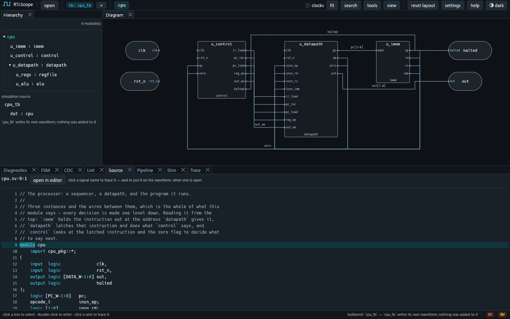
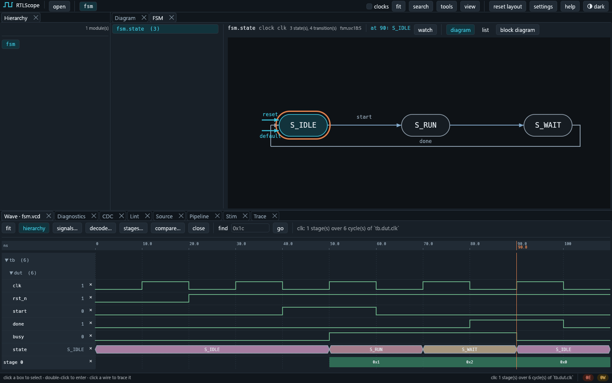
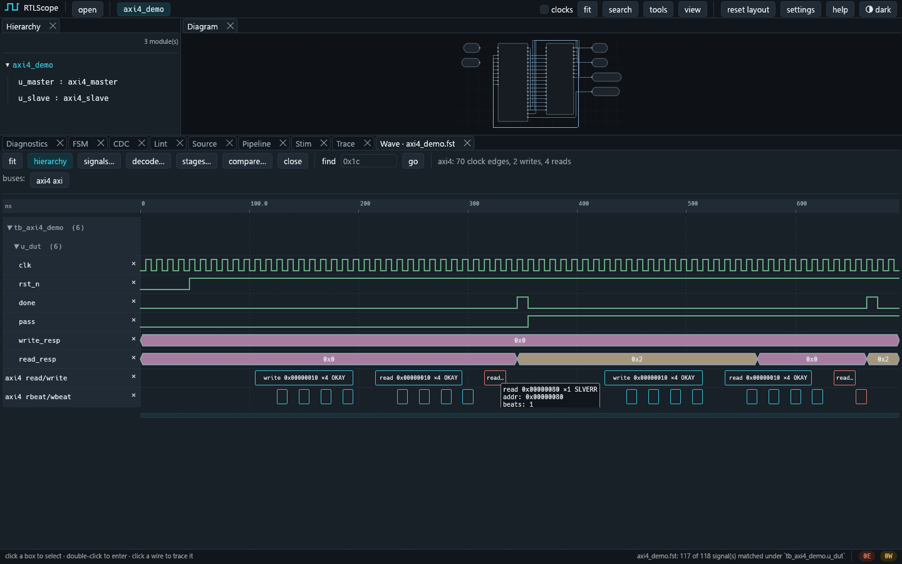
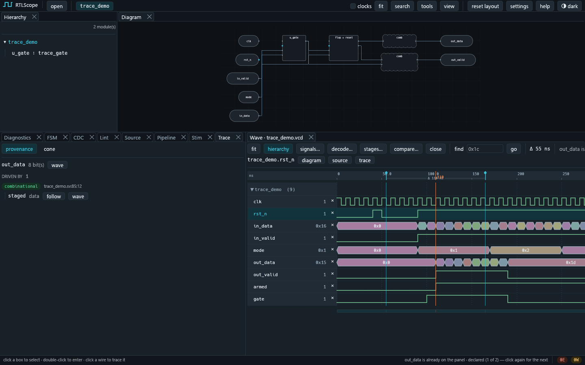
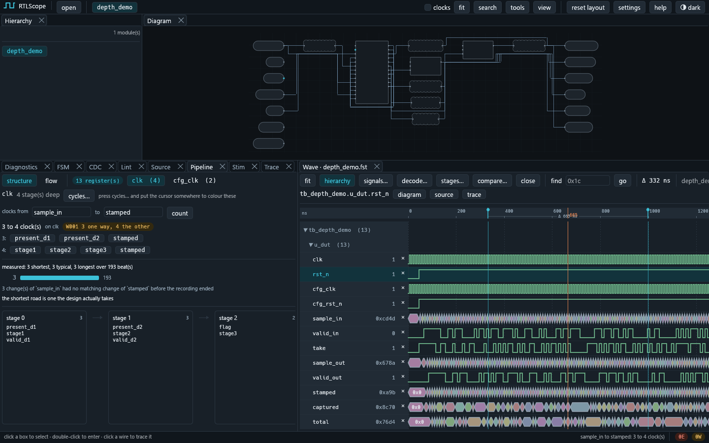
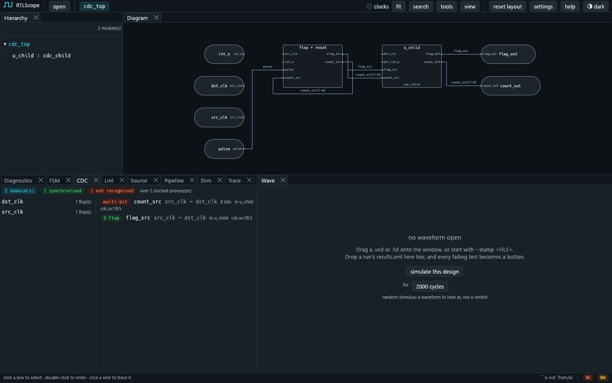
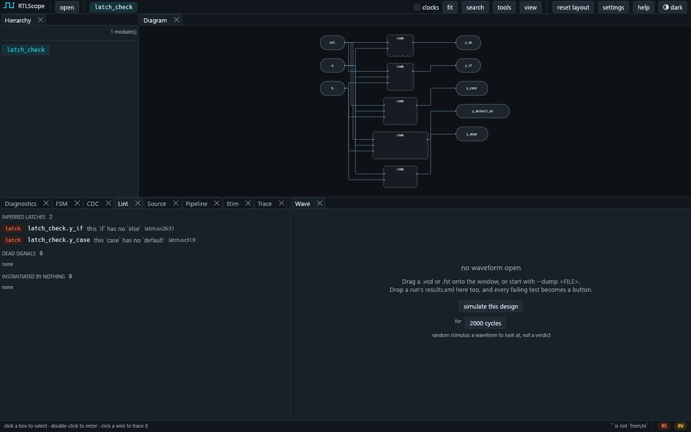
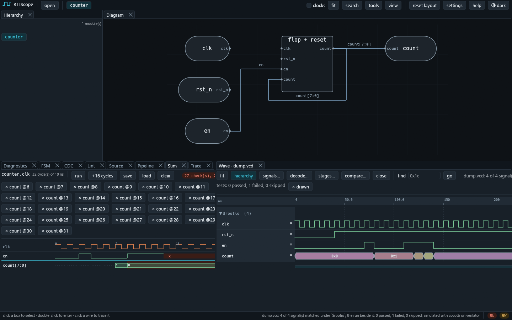

# RTLScope

合成可能な SystemVerilog を読んで、ブロック図・状態遷移図・波形・各種解析を1つの画面で見るツールです。

Windows で開発しています。Rust 製で、GUI・コマンドライン・MCP サーバの3つの入口があります。

## できること

SystemVerilog のファイルかフォルダを渡すと、まずブロック図が出ます。箱をダブルクリックすればその中に入り、線をクリックすればソースの該当行に飛びます。`always_ff` 1つに書かれた3段パイプラインは3つの箱に分かれて描かれ、自分の値を読むカウンタには出力から入力へ戻る線が引かれます。



 FSM タブでは`case` 文で書かれたFSMから状態遷移図を作成します。
 状態が `localparam` でも `typedef enum` でも読みます。
 `cpu` サンプルの `control` なら、FETCH から HALT までの5状態と7本の遷移が `op == HLT` のような条件付きで並びます。
 `default:` アームは「どの状態からでも」の矢印として描き、到達できない状態と出口の無い状態には色が付きます。


VCD か FST をドロップすると波形が開き、設計と突き合わせます。enum 型の信号や FSM の state レジスタは、数値でなく `S_RUN` のような名前で表示されます。波形のカーソルを動かすと、FSM 図ではその時刻の状態に輪が付きます。`decode…` は AXI4 や I²C のハンドシェイクをトランザクションにまとめ、波形の下にレーンとして描きます。





解析は他に4つ。クロックドメイン交差（CDC）の検出、ラッチ推論・未使用信号・組合せループの lint、レジスタの段数とパイプラインの深さ、そして「この信号は何から決まり、何に影響するか」を辿る Trace です。

| Trace — `out_data` は何から決まるか | Pipeline — `sample_in` から `stamped` まで何クロックか |
| --- | --- |
|  |  |
| CDC — 2ドメイン間の交差 | Lint — 推論されたラッチ |
|  |  |

シミュレーションも回せます。Stim タブで波形を描くとテストベンチが生成され、Verilator か Icarus Verilog で走って結果が戻ります。自分で書いたテストベンチがあればそちらをそのまま実行し、その波形を読みます。



同じ解析結果は MCP サーバ経由で LLM にも渡せます。窓で開いている設計について、Claude や他のエージェントが `cone` や `state_machines` を呼んで答えを得られます。

## 向かないもの

IEEE 1800 の全文法には対応できていないです。
対象は合成可能サブセットで、`interface` や `class`、`#遅延` や `wait` は読まずにスキップします
論理合成・配置配線・タイミング解析はしません。Vivado や Quartus の代わりにはならず、それらに入れる前に設計を読むための道具です。

## 使いはじめる

### ビルド

```sh
cargo build --release
```

`rust-toolchain.toml` が Rust 1.93.1 を指しているので、rustup があれば自動で揃います。`target/release/` に `rtlscope`（CLI）、`rtlscope-gui`（GUI）、`rtlscope-mcp`（MCP サーバ）ができます。

PATH に入れるなら:

```sh
cargo install --path crates/rtlscope-cli
cargo install --path crates/rtlscope-gui
```

### まず動かす

サンプルが14個組み込まれています。GUI を起動して `open → a sample` から選ぶか、名前で指定します。

```sh
rtlscope-gui --sample cpu
```

`cpu` は8ビットの小さなプロセッサで、7ファイルに分かれています。開くと「設計が2つある。どちらが top か」と聞かれるので `cpu` を選んでください。隣にある `blink` は、実際のプロジェクトフォルダによくある「もう1つの設計」の再現です。

Hierarchy でモジュールを辿り、Diagram で `u_control` → `u_datapath` → `u_imem` の接続を見て、FSM タブで `control.state` の5状態を確認する、というのが一通りの流れです。Wave タブの `run cpu_tb` を押すとテストベンチが走り、結果の波形が開きます。

ほかのサンプルは目的別です。

| サンプル | 見どころ |
|---|---|
| `hier` | 3階層と3種類の接続方法。最初に開くならこれ |
| `pipeline3` | 3段パイプラインが3つの箱に分かれる。録音付き |
| `fsm` | 2プロセスの FSM。録音付きで、カーソルの状態に輪が付く |
| `trace_demo` | 「`out_data` はなぜこの値か」を Trace で遡る |
| `cdc` `latch` `comb_loop` | それぞれの解析が何を捕まえるか |
| `axi4` | AXI4 のトランザクションを波形からデコード |
| `veryl` | Veryl で書かれたプロジェクト。`.sv.map` 経由で `.veryl` の行に飛ぶ |

### 自分の設計を開く

ファイルでもフォルダでも、ドロップするか引数で渡します。

```sh
rtlscope-gui path/to/rtl/          # フォルダごと
rtlscope-gui top.sv sub.sv --top top
rtlscope-gui top.sv --dump sim.vcd # 波形と一緒に
```

top が1つに決まらなければ候補が出ます。Hierarchy の行を右クリックすれば、後から別のモジュールを top にできます。

### インストーラ（Windows）

```powershell
dotnet tool install --global wix --version 5.0.2
pwsh scripts/package.ps1
# → target/installer/RTLScope-0.1.0-x64-setup.exe
```

`.sv` `.v` `.vcd` `.fst` を「プログラムから開く」の候補に追加します。既定のアプリは変えません。WiX は v5 を指定してください。v7 は保守料の EULA 同意を求めてきて、`wix build` が止まります。

## 使い方

### GUI

ビューはタブで、ドラッグして並べ替えたり、別ウィンドウに切り離したりできます。配置は次回も残ります。

| タブ | 答える問い |
|---|---|
| Hierarchy | モジュールはどう入れ子になっているか。テストベンチを読み込むと `simulation source` の節が増える |
| Diagram | このモジュールの中はどう繋がっているか |
| Source | その行はどこか。信号名をクリックすると図で光り、波形に載る |
| Wave | 録音で何が起きたか。`←` `→` で選んだ信号のエッジへ、`M` でマーカー。行は名前をドラッグするか `alt` `↑` `↓` で並べ替え |
| FSM | 状態遷移図。状態をクリックすると `case` のアームがソースで指される |
| Trace | この信号は何から決まるか、何に影響するか |
| Pipeline | 何段あり、各段に何が載っているか。`stages…` でサイクルに沿って並べる |
| CDC / Lint / Diagnostics | 交差・ラッチ・読めなかった構文の一覧 |
| Stim | 波形を描いてシミュレーションにかける |

どのビューの `file:line` も Source タブに繋がっています。操作の一覧は `help` メニューにあります。

### コマンドライン

GUI と同じ解析を、JSON か SVG で出します。

```sh
rtlscope diagram cpu/*.sv --top cpu -o cpu.svg   # ブロック図
rtlscope fsm cpu/*.sv --top cpu                  # 状態と遷移の一覧
rtlscope lint cpu/*.sv --top cpu
rtlscope pipeline cpu/*.sv --top cpu
rtlscope cone out cpu/*.sv --top cpu             # `out` は何から決まるか
rtlscope sim cpu cpu/*.sv --top cpu              # ランダム刺激で走らせて波形を開く
rtlscope sim cpu cpu/*.sv --top cpu --testbench cpu_tb.sv
```

コマンドは17個あります。`rtlscope --help` で一覧、`--diag-format json` で診断を機械可読に出せます。

### MCP サーバ

`.mcp.json` にサーバの定義があるので、Claude Code などからそのまま使えます。設計の読み込みは窓と共有されていて、窓で開いている設計についてエージェントに聞けます。

```sh
rtlscope-mcp    # stdio で待ち受け
```

ツールは19個。`modules` / `diagram` / `state_machines` / `cone` / `drivers` / `lint` / `pipeline_depth` / `path_latency` / `decode` / `yosys_check` など、GUI の各タブに対応します。

## 特徴

RTLScope のビューはどれも、パースとエラボレーションの結果である1つの中間表現を見ています。ブロック図も FSM も、波形の信号名の付け方も lint も、同じ IR への別の問いです。そのため、図の線をクリックすると波形に出て、波形の行を選ぶと図が光る、という行き来で答えが食い違いません。

読めなかった構文は、飛ばした上で件数を報告し、モジュールの箱にも出します。不正確な図を正しそうに描くより、描けない箇所は描けないと言う方が読む側の役に立つ、という考えです。

自分で書いたテストベンチを読ませたとき、RTLScope が見るのは2点だけです。どのモジュールが top か（ポートの無いモジュール）と、波形を自分で書いているかどうか。ハーネスを被せることも、ダンプ命令を足すこともしません。設計とは別に読むので、Hierarchy では別の節に出ます。

Veryl のプロジェクトも開けます。Veryl が出力する `.sv.map`（ブラウザの Source Map と同じ形式）を読むので、解析対象は生成された SystemVerilog でも、ジャンプ先は書いた `.veryl` の行です。

## 理解する範囲

対応するのは `module`（ANSI / 非ANSI）、整数の `parameter`、`generate for/if`、`always_ff` / `always_comb` / `always_latch`、`assign`、`if` / `case` / `casez`、`function` / `task`（呼び出し箇所に展開）、定数境界の `for` / `while`、`initial`（電源投入値として）、packed 範囲、1次元の unpacked 配列、`typedef enum`、パッケージ、`$clog2`、サイズキャストです。

対応しないのは `interface` / `class` / `program`、`struct` / `union`、`#遅延` / `wait` / `forever`、階層参照 `a.b.c`、多次元配列、SVA、DPI です。`defparam` はエラーになります（値が「どこから見るか」で変わるため）。`casex` も読みません（x を暗黙のワイルドカードにするのは合成では危険なので）。

診断には `RK0107` のような番号が付き、変わりません。`RK09xx` が出たら RTLScope 自身のバグなので報告してください。

## 必要なもの

ビルドと図・解析には Rust だけで足ります。
シミュレーションには外部ツールが要ります。
どれも別プロセスとして起動するだけで、リンクも同梱もしていません。

| ツール | 用途 |
|---|---|
| Verilator | シミュレーション（既定）。MSYS2 ucrt64 の `pacman -S mingw-w64-ucrt-x86_64-verilator` |
| Icarus Verilog | `--engine icarus`。フィクスチャの合法性チェックにも使う |
| cocotb | 生成したハーネスの実行。`.venv-cocotb` に入れる（Verilator には ucrt64 の Python が必要） |
| Yosys | `yosys-check` で IR とネットリストを突き合わせるときだけ |
| Veryl | `.veryl` プロジェクトを開くときだけ |

Windows では、cocotb から Verilator に届くまでに詰まりどころがいくつかあります。どのシミュレータを使ったかは実行のたびに `[rtlscope] verilator: <path>` と出るので、見つからない・別のものが見つかった場合はその行で分かります。

## 資料

- `tests/fixtures/` — 検証用の SystemVerilog 26本と、サンプルの元になっている設計
- `docs/screenshots/` — この README の画面写真
- 各クレートの `src/` — 何をどう決めたかはコードのドキュメントコメントに書いてあります

## 開発

```sh
cargo test
cargo clippy --all-targets
cargo fmt --all
```

`cargo test` はどのシェルからでも同じように走ります。シミュレータや cocotb が無い環境ではそのテストだけがスキップされ、理由が表示されます。

クレートは `rtlscope-ir`（型定義だけ）を底に、`sv`（パース）→ `elab`（エラボレーション）→ `analyse` / `graph` / `wave` / `tb`（解析・描画・波形・テストベンチ）→ `cli` / `gui` / `mcp`（入口）と積んであり、下の層は上の層を知りません。

## ライセンス

MIT License と Apache License 2.0 のデュアルライセンスです。どちらかを選んで使えます。本文は [LICENSE-MIT](LICENSE-MIT) と [LICENSE-APACHE](LICENSE-APACHE) にあります。

バイナリに含まれる Rust クレートとそのライセンスは [THIRD-PARTY-NOTICES.md](THIRD-PARTY-NOTICES.md) に列挙し、各ライセンスの本文を再掲しています。コピーレフトのものは含みません。`rtlscope-gui` には egui 既定のフォント（Ubuntu Light、Noto Emoji、Hack、emoji-icon-font）が埋め込まれていて、それぞれ Ubuntu Font Licence 1.0、SIL Open Font License 1.1、MIT の下にあります。帰属表示は同じファイルの末尾です。

上に挙げた外部ツールは Verilator が LGPL-3.0 / Artistic-2.0、Icarus Verilog が GPL-2.0、cocotb が BSD-3-Clause、Yosys が ISC、Veryl が MIT / Apache-2.0 です。
